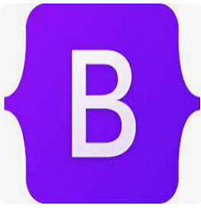

<h2 align="left"> About me</h2>

I successfully completed an IT bootcamp - PHP development organized by the Vlade Divac Foundation.
The IT bootcamp is an excellent starting point for me to enter the world of programming, to become part of those who create web applications and help employees from various fields to be more productive in their work. I continue to learn and pursue professional development.

- 🌱 I’m currently learning **Java Script**
<table>
  <tr>
    <td align="center" width="100">
        
       HTML
    </td>
    <td align="center" width="96">
        
       CSS
    </td>
    <td align="center" width="96">
        
       Bootstrap
    </td>
    <td align="center" width="96">
        
       PHP
    </td>
      <td align="center" width="96">
        
       LARAVEL
    </td>
      <td align="center" width="96">
        
       SQL
    </td>
     <td align="center" width="96">
        
       MySQL
    </td>
  </tr>
</table>

